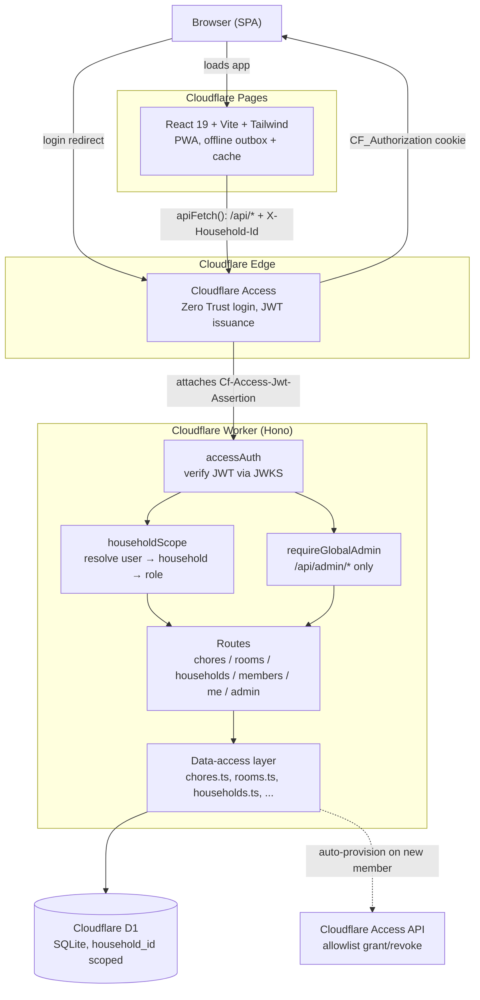

# Chore Reaper

Multi-tenant, cloud-hosted chore/task tracker on Cloudflare (Workers + Hono, D1, Pages, Access).

Live at [chores.4irl.app](https://chores.4irl.app). Seeded once from a sibling project (`chores4irl`) —
no ongoing dependency on it.

- **[`ARCHITECTURE.md`](ARCHITECTURE.md)** — the full map: request flow, multi-tenancy/auth model,
  database, environments, CI/CD, and a "where to look for X" index. Read this first for any non-trivial
  change.
- **[`TRADEOFFS.md`](TRADEOFFS.md)** — what this cloud-native design costs relative to a fully local
  deployment, and why it was chosen anyway.

## Architecture at a glance

See [`ARCHITECTURE.md`](ARCHITECTURE.md) for the full request-flow walkthrough, the multi-tenancy/auth
model, database schema notes, and local dev / production environment details.
